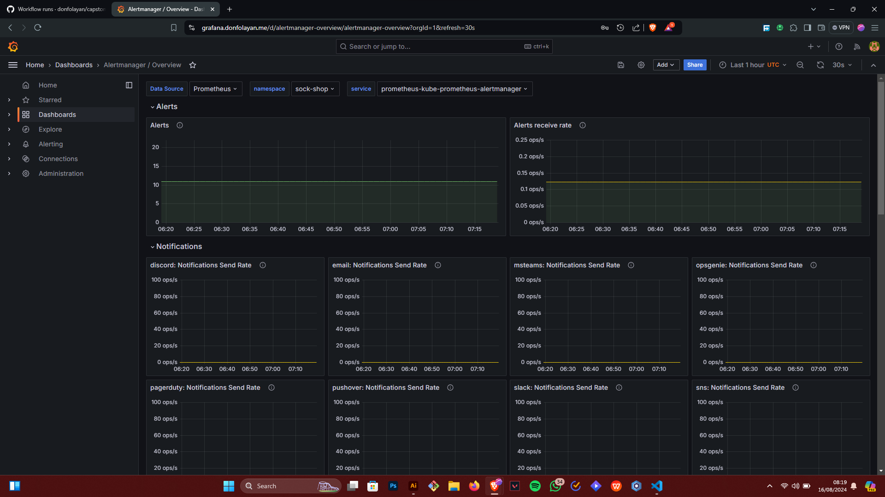
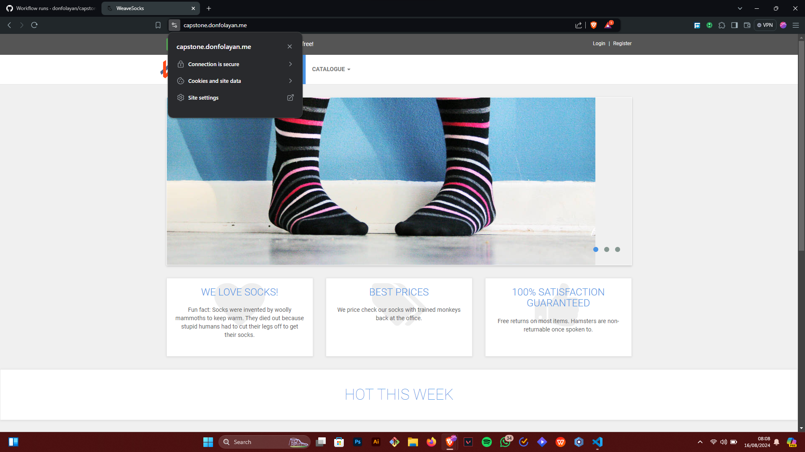
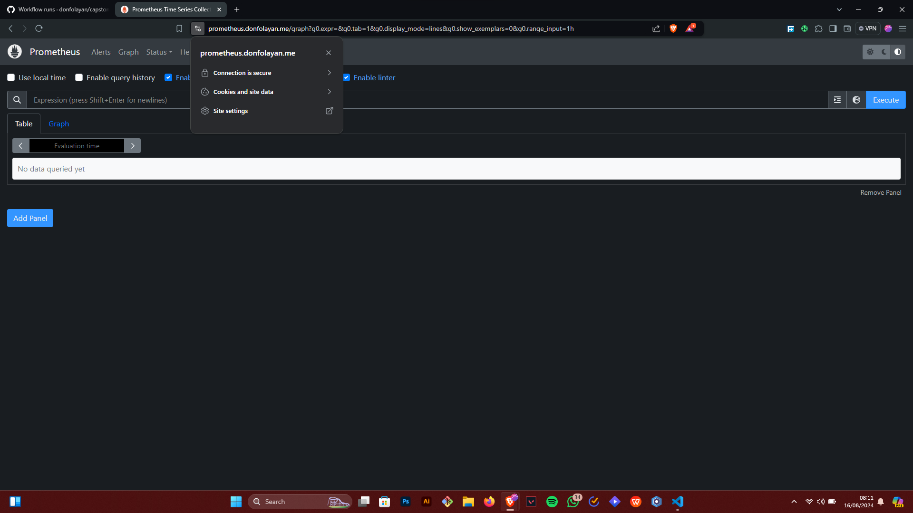
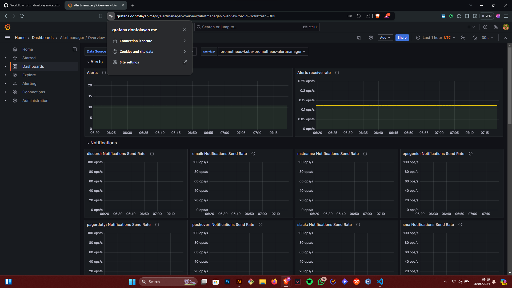

# AltSchool Cloud Engineering Tinyuka 2023 Capstone Project Documentation

## Project Overview

This project focuses on deploying the Socks Shop microservices-based application using Infrastructure as Code (IaC) principles on Azure Kubernetes Service (AKS). The deployment includes automated setup, HTTPS with Let's Encrypt, and monitoring with Prometheus and Grafana.

## Objective

Deploy the Socks Shop application with emphasis on automation, maintainability, and security. Use Terraform for infrastructure provisioning and GitHub Actions for CI/CD.

## Prerequite Technologies

1. Azure CLI
2. Terraform
3. Helm
4. Git
5. Github Actions
6. Prometheus
7. Grafana
8. Azure Subscription

## Project Structure

1. Terraform Configuration
- File: main.tf

    - Providers:
        - azurerm: Azure Resource Manager
        - random: Generates random values for unique resource names
        - helm: Manages Helm charts
    - Resources:
        - Resource Group: sockshop_capstone-rg
        - Network Security Group: capstone-security-group
        - Virtual Network: capstone-network
        - Azure Kubernetes Service: capstone-aks
    - Data Sources:
        - Azure Key Vault: Fetch secrets for AKS service principal

- File: outputs.tf

    - Outputs:
        - Resource group name
        - Kubernetes cluster name
        - Sensitive kubeconfig for AKS
        - File: variables.tf

    - Variables:
        - client_id
        - password
        - keyvault_id

2. GitHub Actions Workflows
- File: .github/workflows/deploy.yml

    - Actions:
        - Checkout code
        - Set up Terraform
        - Initialize and apply Terraform
        - Configure kubectl
        - Deploy Helm charts for Prometheus, Grafana, and the Socks Shop application
        - Apply Kubernetes manifests

- File: .github/workflows/delete.yml

    - Actions:
        - Delete the Azure resource group during testing

- File: .github/workflows/update.yml

    - Actions:
        - Apply Kubernetes manifests on code changes

3. Kubernetes Files
    - Files:

        - Ingress Configurations:
        - Configure HTTPS with Let's Encrypt certificates
        - Prometheus and Grafana:
        - Deployment and service configurations for monitoring and visualization

4. Monitoring and Logging
    - Prometheus:

        - Purpose: Monitoring metrics
        - Access: Port-forwarding to access Prometheus dashboard

    - Grafana:

        - Purpose: Visualization of metrics
        - Access: Port-forwarding to access Grafana dashboard

    - Alertmanager:

        - Purpose: Manage alerts and notifications

## Project Steps

1. Log into Azure CLI.

    - Open a terminal and run the command: az login.
    - This command will open a web page where you can log in to your Azure account and select the desired subscription.

2. Create Terraform Files:

    - `main.tf`
    
        - This file defines the Terraform providers I will use (AzureRM, Random, and Helm).
        - It sets up the Azure resource group named "sockshop_capstone-rg" if it isn't already setup
        - Configures the Network Security Group (NSG), creates a Virtual Network (VNet) with subnets, and provisions the Azure Kubernetes Service (AKS) cluster.

    - `outputs.tf`

        - This file defines output variables to display essential information after deployment:
            - `resource_group_name`: Outputs the name of the resource group.
            - `kubernetes_cluster_name`: Outputs the name of the Kubernetes cluster.
            - `kube_config`: Outputs the Kubernetes admin configuration (set as sensitive to protect credentials).

    - `variables.tf`

    - This file declares variables for sensitive information
        - `client_id`: The client ID for the AKS service principal.
        - `password`: The password (client secret) for the AKS service principal.
        -  `keyvault_id`: The ID of the Azure Key Vault containing the secrets.
    - These variables are populated from Azure Key Vault secrets.

3. Kubernetes Files:

    - `ingress.yaml`

        - Configures an Ingress resource to expose your Kubernetes services to the internet.
        - Creates a LoadBalancer service to assign an external IP address.
        - Sets up HTTPS by interacting with a certificate for secure web traffic.

    

    - `prometheus-ingress.yaml`

        - Defines an Ingress resource to expose Prometheus, which runs on port 9090, to the internet.
        - This allows you to access Prometheus for monitoring metrics.
    
    

    

    - `grafana-ingress.yaml`

        - Configures an Ingress resource to expose Grafana to the internet.
        - This enables you to access Grafana for visualization of monitoring data.

    

    - `rolebinding.yaml`   
        
        - Sets up a ClusterRoleBinding to grant the necessary permissions for accessing the entire cluster.
        - This allows the specified role to interact with resources across the cluster.

    - `manifest.yaml`

        - This file defines the necessary Kubernetes resources required for the deployment of the application.

    - `cert-issuer.yaml`

        - This file manages the process of issuing SSL/TLS certificates from Let's Encrypt.

    - `cert-manager-values.yaml`

        - The cert-manager-values.yaml file configures the Helm chart for installing cert-manager with specific settings.

    - `certificate.yaml`

        - This file configures cert-manager to request a certificate from the letsencrypt-prod Issuer, covering multiple DNS names, and store the resulting certificate and key in a Kubernetes Secret.

3. Create Github Actions:

    - `deploy.yaml`:

    This file automates the deployment process for the Socks Shop application from start to finish.
        
    _**Steps**_
    
    a. **Checkout Code:**
        - Uses the actions/checkout action to clone the repository.
    
    b. **Setup Azure CLI:**
        - Configures Azure CLI for authentication using credentials stored in GitHub Secrets. This step allows the workflow to interact with Azure resources.
    
    c. **Assign Roles:**
        - Assigns the necessary Azure roles (Contributor and User Access Administrator) to the service principal, ensuring it has the required permissions to manage resources.

    d. **Create Resource Group:**
        - Creates an Azure Resource Group if it doesn’t already exist, providing a container for related resources.
    
    e. **Create Key Vault:**
        - Creates an Azure Key Vault to securely store secrets. Includes a loop to wait until the Key Vault is fully provisioned.

    f. **Assign Permissions to Service Principal:**
        - Grants the service principal access to manage secrets in the Key Vault.
    
    g. **Store Secrets in Key Vault:**
        - Stores important secrets (client-id, password, subscription-id) in the Key Vault for secure retrieval later.

    h. **Get Key Vault ID:**
        - Retrieves the Key Vault ID and sets it as an environment variable for use in subsequent steps.

    i. **Setup Terraform:**
        - Installs Terraform on the runner, preparing it for use in infrastructure management.

    j. **Terraform Init:**
        - Initializes the Terraform working directory, downloading necessary providers and modules.
    
    k. **Import Resource:**
        - Imports existing Azure resources into Terraform state, ensuring Terraform manages them going forward.

    l. **Terraform Validate:**
        - Validates the Terraform configuration files for syntax and logical errors.
    
    m. **Terraform Plan:**
        - Creates an execution plan, showing what changes Terraform will make to the infrastructure.

    n. **Terraform Plan Status:**
        - Ensures that the workflow fails if the Terraform plan step encounters errors.

    o. **Terraform Apply:**
        - Applies the Terraform configuration to create or update infrastructure without manual approval.

    p. **Terraform Output:**
        - Outputs the results of the Terraform apply step, which can include details like the kubeconfig file.

    q. **Apply Application Manifests:**
        - Deploys the Socks Shop application and other Kubernetes resources using the specified manifests.

    r. **Install Ingress:**
        - Installs the NGINX Ingress Controller and waits until it is ready to handle incoming traffic.
    
    s. **Install Prometheus Stack:**
        - Adds the Prometheus Helm repository, updates it, and installs the Prometheus monitoring stack which includes prometheus, grafana, alertsmanager and a couple other monitoring tools.

    t. **Install Cert-Manager:**
        - Installs Cert-Manager for managing SSL/TLS certificates and creating necessary resources.

    u. **Apply Certificate, Ingress Files, Rolebinding:**
        - Applies various Kubernetes manifests for certificates, ingress, and role bindings to ensure the application is securely accessible.
    
    v. **Terraform Destroy:**
        - Cleans up resources if any previous steps fail, ensuring that the environment is left in a clean state.

    
    - `update.yaml`

    This is a workflow that automatically applies Kubernetes manifests to an Azure Kubernetes Service (AKS) cluster whenever there are changes to files matching the pattern **/manifest.yaml in the repository.

    Steps:

    a. **Checkout Code:**
        - Clones the repository containing the Kubernetes manifests and other code to the GitHub Actions runner. This makes the files available for the workflow to use in subsequent steps.

    b. **Setup Azure CLI:**
        - Logs into Azure using credentials stored in GitHub Secrets. This allows the workflow to perform actions on Azure resources, such as accessing the AKS cluster.

    c. **Get AKS Credentials:**
        - Uses the Azure CLI to fetch credentials for the Azure Kubernetes Service (AKS) cluster. These credentials configure kubectl (the Kubernetes command-line tool) to interact with the specific AKS cluster.

    d. **Apply Kubernetes Manifest:**
        - Applies the specified Kubernetes manifest (manifest.yaml) to the AKS cluster. This can involve creating, updating, or deleting Kubernetes resources based on the definitions in the manifest file. It ensures that the desired state of the application or other resources in the cluster is achieved.

